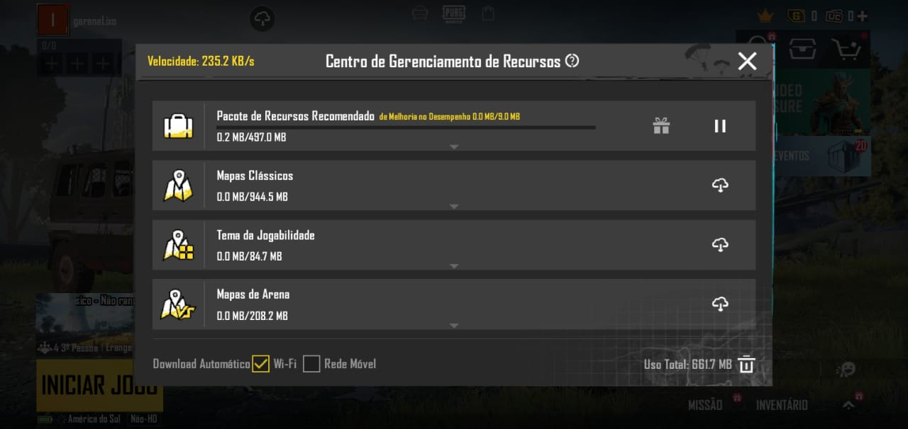

# Unity-Asset-Bundle-Download-Center
open source used to manage downloaded assets and not

Still in creation...

what the package should do

- check if asset bundle collections are downloaded:
          example: animations, audios, dlc...
(checking crc or similar)

- if 'asset package' is outdated or non-existent, enable the download option

- if the 'asset package' already exists, you can delete or deactivate it to save ram memory or avoid dropping fps (bottlenecks)

- the user will also be able to delete and downgrade the 'asset package' if he has any errors

- also have option to start download, pause and stop download

- the download must have visual information for the user to verify the download speed statistics by himself

/* if you are interested in participating in the project, contact us through discord */

https://discord.gg/RTsq5xcM

image for reference only:

